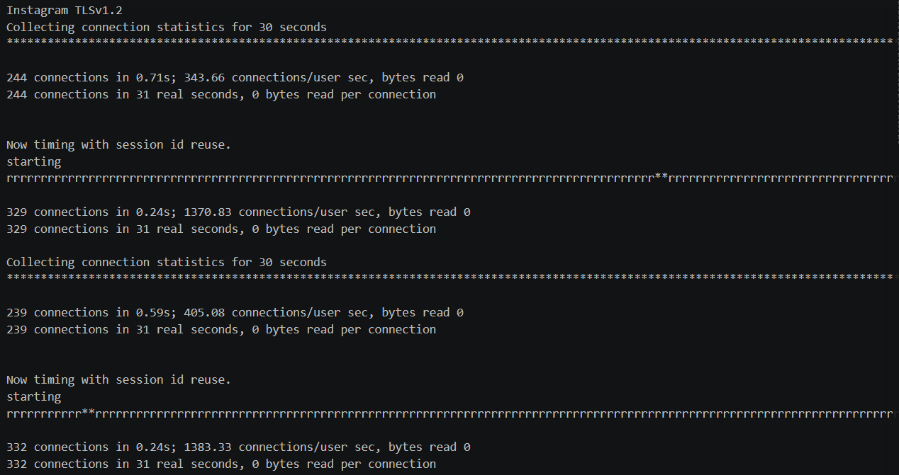
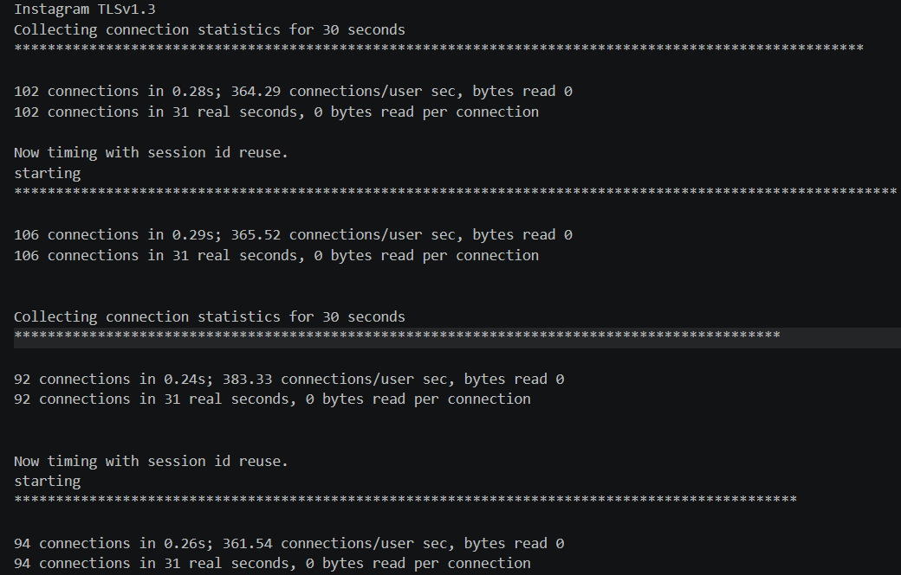
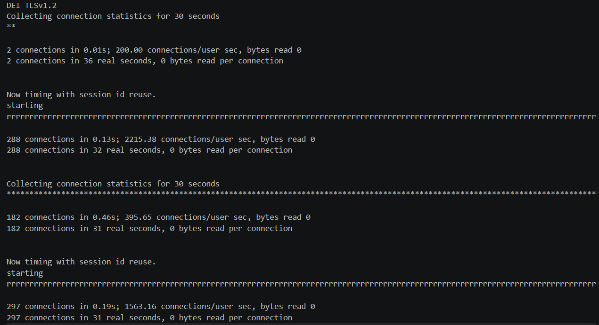

# Report 2

## 4.1.1

Running `openssl s_client -connect instagram.com:443 -msg -trace < /dev/null > 4.1-instagram.txt`, the connection was established using TLS 1.3, as shown in the output below. The client offered TLS 1.3 and TLS 1.2 in the supported_versions extension of the ClientHello message, and the server selected TLS 1.3 in its ServerHello. The final OpenSSL summary confirms this with Protocol: TLSv1.3

## 4.2.2

The initial attempt using  `openssl s_client -connect instagram.com:443 -msg -trace -tls1_1 < /dev/null > 4.2.1-instagram.txt`, failed locally with the error no protocols available, so it did not establish whether the server supported TLS 1.1, the result is:

This happens because version 3 of openssl refused to start a tls1_1 connection. To really test the server, we used `openssl s_client -connect instagram.com:443 -msg -trace -tls1_1 -cipher "DEFAULT@SECLEVEL=0" < /dev/null > 4.2.2-instagram.txt` to decrease the client's security level, the handshake completed successfully. The server selected TLS 1.1 in its ServerHello, and the session summary confirmed Protocol: TLSv1.1, with cipher suite ECDHE-ECDSA-AES128-SHA. Therefore, the tested server accepted a TLS 1.1 connection, allowing the use of tls1_1, and the result is:

## 4.3.3

Running `openssl s_client -connect instagram.com:443 -msg -trace -debug < /dev/null > 4.3-instagram.txt`, we identified the cipher suites offered by the client in the cipher_suites field of the ClientHello message, as shown below:

## 4.3.4

Using the same output, we identified TLS_CHACHA20_POLY1305_SHA256 as the cipher suite selected by the server, as indicated by the cipher_suite field in the ServerHello message shown below:

## 4.3.5

In the ClientHello message, the cipher_suites field is ordered by client preference. openssl first puts TLS1.3 cipher suites and then the rest, ordered by key exchange type and strength. This means that technically TLS_AES_256_GCM_SHA384. The server chose TLS_CHACHA20_POLY1305_SHA256 because it's better for streaming type websites. 

In the ClientHello message, cipher suites are listed in descending order of client preference. In this test, TLS_AES_256_GCM_SHA384 appeared first, but the server selected TLS_CHACHA20_POLY1305_SHA256. This preference order does not necessarily represent a ranking from most to least secure.
Considering encryption key length, both AES-256 and ChaCha20 use 256-bit keys, whereas AES-128 uses a 128-bit key. Therefore, the server selected a suite with one of the largest encryption key sizes offered by the client. The SHA384 and SHA256 suffixes identify the hash functions used in TLS key derivation and handshake processing, rather than the encryption key sizes. However, key length alone is insufficient to determine which suite is the most secure overall.
Performance may also influence cipher suite selection. ChaCha20-Poly1305 can outperform AES-GCM in software when AES hardware acceleration is unavailable. Although ChaCha20 is a stream cipher, this does not mean that it is specifically intended for streaming websites. The observed output confirms the selected suite, but does not reveal whether the server chose it for performance reasons or because of its configured preferences.

## 4.4.6

We tested Instagram with TLS 1.3 and TLS 1.2, and dei.uc.pt with TLS 1.2, performing multiple runs for each configuration. The TLS 1.3 attempt against dei.uc.pt failed with a handshake failure alert, so no timing results were obtained for that configuration.
Instagram with TLS 1.2 achieved the highest observed connection rate in real time. For new sessions, it reached a maximum of 244 connections in 31 seconds, approximately 7.87 connections/s. During the session reuse phase, it reached 332 connections in 31 seconds, approximately 10.71 connections/s. Across its two runs, the aggregate rates were 7.79 connections/s for new sessions and 10.66 connections/s during the reuse phase.
Session reuse improved the observed connection rate for both websites with TLS 1.2. However, the Instagram TLS 1.3 runs displayed only * characters, including during the reuse phase, indicating that sessions were not actually resumed in these tests. These results therefore do not establish that TLS 1.2 is inherently faster than TLS 1.3.
The highest reported connections/user sec value was 2215.38, obtained by dei.uc.pt with TLS 1.2 during session reuse. This metric uses user CPU time rather than elapsed real time; that run completed 288 connections in 32 real seconds, equivalent to 9.00 connections/s.
Results varied between runs, particularly the first dei.uc.pt test, which completed only two new connections in 36 seconds. The reported maxima are the highest values observed in these experiments, rather than the servers’ maximum connection capacity, as shown below:

**Instagram TLSv1.2**

**Instagram TLSv1.3**

**DEI TLSv1.2**

## 4.5.7

Running `openssl s_client -connect instagram.com:443 -trace < /dev/null > 4.5-instagram.txt`, we can check the Certificate part of the output and identify the Subject field with the value:

The Public Key Algorithm is id-ecPublicKey and the Key size is 256 bit as seen below:

