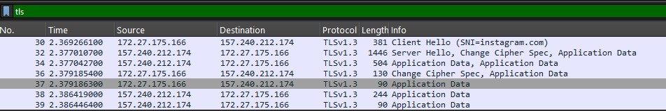
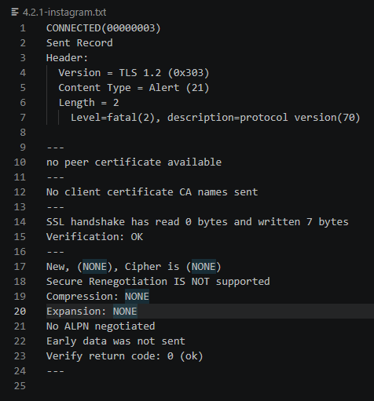
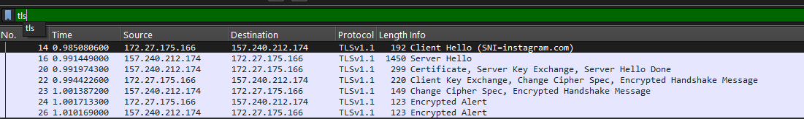
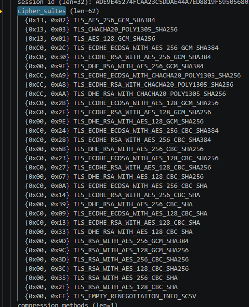
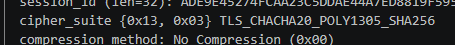
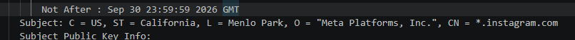
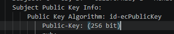

# Report 2

## 1

Running `openssl s_client -connect instagram.com:443 -msg -trace < /dev/null > 4.1-instagram.txt`, the version used is TLS1.3 based on:

## 2

Running `openssl s_client -connect instagram.com:443 -msg -trace -tls1_1 < /dev/null > 4.2.1-instagram.txt`, the result is:

This happens because version 3 of openssl refused to start a tls1_1 connection. To really test the server, we used `openssl s_client -connect instagram.com:443 -msg -trace -tls1_1 -cipher "DEFAULT@SECLEVEL=0" < /dev/null > 4.2.2-instagram.txt` to decrease the client's security level, allowing the use of tls1_1, and the result is:

## 3

Running `openssl s_client -connect instagram.com:443 -msg -trace -debug < /dev/null > 4.3-instagram.txt`, we can check the ClientHello message to identify the cipher_suites filed with the client's offers:

## 4

Using the same output, we can check the ServerHello message to identify the cipher_suite field with the server's choice:

## 5

In the ClientHello message, the cipher_suites field is ordered by client preference. openssl first puts TLS1.3 cipher suites and then the rest, ordered by key exchange type and strength. This means that technically TLS_AES_256_GCM_SHA384. The server chose TLS_CHACHA20_POLY1305_SHA256 because it's better for streaming type websites.  

## 6

## 7

Running `openssl s_client -connect instagram.com:443 -trace < /dev/null > 4.5-instagram.txt`, we can check the Certificate part of the output and identify the Subject field with the value:

The Public Key Algorithm is id-ecPublicKey and the Key size is 256 bit as seen below:

