# Exercise 03 - Public Key Infrastructure (PKI)

## 4
### 4.1 
#### Question 1.

The section [v3_ca] contains X.509 v3 extensions that are intended to be included in a Certificate Authority certificate. These extensions provide additional information about the role of the certificate and the permitted uses of its cryptographic key.
The first extension is basicConstraints = critical, CA:true. The basicConstraints extension is mainly used to indicate whether a certificate can act as a Certificate Authority (CA).
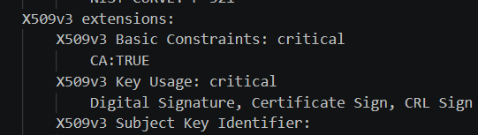

Certificate Authority. The value CA:true means that the certificate is explicitly identified as a CA certificate. This is important because a CA certificate can be used to establish a chain of trust and, when combined with the appropriate key usage, can be used to sign and issue other certificates. A normal end-entity/server certificate, such as a certificate used only by a web server, would normally use CA:false or ommit the extension, would not be treated as a CA certificate.
The word critical has a specific meaning in X.509 certificates. It does not simply mean that the extension is important. Instead, it means that any application validating the certificate must understand and correctly process the extension. If the application does not recognize or cannot process a critical extension, it must not simply ignore it and continue trusting the certificate. This prevents important security restrictions from being bypassed.
The second extension is keyUsage = critical, digitalSignature, cRLSign, keyCertSign. The keyUsage extension restricts the purposes for which the cryptographic key associated with the certificate may be used.

digitalSignature means that the private key may be used to generate digital signatures. A digital signature provides integrity and authentication because it allows another entity to verify that the signed information was produced by the holder of the corresponding private key and that the signed data has not been modified.

keyCertSign means that the private key may be used to sign certificates. This permission is especially important for a CA because issuing a certificate involves digitally signing certificate information with the CA's private key. Other systems can then verify that signature using the CA's public key.
cRLSign means that the private key may be used to sign Certificate Revocation Lists. A CRL contains the serial numbers or identifiers of certificates that have been revoked before their expiration date, for example because the private key associated with a certificate has been compromised. By signing the CRL, the CA allows clients to verify that the revocation information is authentic and has not been altered.


### 4.2
##### Question 2

The [server] and [client] sections define X.509 v3 extensions for certificates that will be used respectively by a TLS server and a TLS client. These extensions specify both the cryptographic operations that the certificate's key may perform and the specific purpose for which the certificate is intended.
Server:
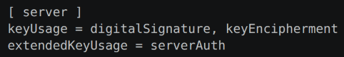

The keyUsage extension defines the cryptographic operations that are permitted for the key associated with the certificate.

DigitalSignature means that the private key corresponding to the certificate may be used to create digital signatures. 
In the context of TLS, this is important because the server may need to prove possession of its private key by signing data during the TLS handshake and the client can then verify that signature using the public key contained in the server certificate. 
This mechanism contributes to server authentication and helps ensure that the entity participating in the handshake actually possesses the private key corresponding to the certificate.

keyEncipherment means that the key may be used in operations related to key encryption or key transport. Nevertheless, keyEncipherment remains an X.509 key usage value and may still be present for compatibility with older RSA-based configurations.

The extendedKeyUsage = serverAuth extension provides a more specific indication of the intended purpose of the certificate. While keyUsage describes the types of cryptographic operations that the key may perform, extendedKeyUsage describes the application-level role of the certificate. The value serverAuth indicates that the certificate is intended to authenticate a TLS server.
Therefore, when a client such as a web browser connects to an HTTPS server, the server presents a certificate whose purpose is normally compatible with server authentication. The client verifies the certificate chain, checks the certificate validity and identity information, and may also check that the certificate is suitable for TLS server authentication.

Client:
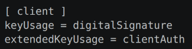

The digitalSignature value again allows the private key associated with the certificate to be used to create digital signatures. In this case, the client may use its private key to sign data during the TLS handshake in order to prove to the server that it possesses the private key corresponding to the public key contained in the client certificate.
This is particularly relevant in mutual TLS. In ordinary TLS, the client normally authenticates the server by validating the server certificate. In mutual TLS, the server also requests a certificate from the client, allowing both sides to authenticate each other. The client proves possession of its private key by generating a digital signature, and the server verifies that signature using the public key contained in the client's certificate.

The extendedKeyUsage = clientAuth value indicates that the certificate is specifically intended for TLS client authentication. It distinguishes a client-authentication certificate from a server-authentication certificate, even though both certificates may use similar cryptographic algorithms and may both contain the digitalSignature key usage.

### 4.3
#### Question 3

To generate an Elliptic Curve private key instead of the 4096-bit RSA key, I used the secp521r1 curve, also known as NIST P-521. The command used was:
```bash
openssl genpkey -algorithm EC -pkeyopt ec_paramgen_curve:secp521r1 -out ca-ec.key
```
The resulting private key was confirmed with OpenSSL as a 521-bit EC key using the secp521r1 curve:

Private-Key: (521 bit)
ASN1 OID: secp521r1
NIST CURVE: P-521
The original RSA key was generated with a size of 4096 bits:
Private-Key: (4096 bit, 2 primes)
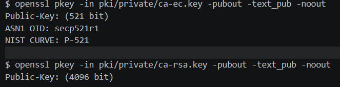

The EC key was then used to generate the CA certificate. The resulting certificate uses id-ecPublicKey as the public-key algorithm and ecdsa-with-SHA256 as the signature algorithm, whereas the RSA certificate uses rsaEncryption and sha256WithRSAEncryption.
The RSA and EC bit lengths cannot be compared directly because they are based on different mathematical security problems. RSA security relies on the difficulty of factoring large integers, while ECC relies on the difficulty of the Elliptic Curve Discrete Logarithm Problem. Consequently, ECC can provide a high level of security using substantially smaller keys.
This difference was also visible in the generated files. The RSA private key occupied approximately 3272 bytes, while the EC private key occupied approximately 365 bytes. The RSA certificate occupied approximately 1984 bytes, while the EC certificate occupied approximately 940 bytes. These values depend on the encoding and file format, but they illustrate the substantially smaller representation of the elliptic-curve key and certificate.
Both CA certificates contained the same CA-related X.509 extensions because came from the same openssl-cc.cnf
Therefore, both certificates perform the role of a Certificate Authority, but they use different public-key cryptographic systems. The RSA version uses a 4096-bit RSA key, while the EC version uses the P-521 elliptic curve, achieving strong security with a significantly smaller key representation.

The EC key is 521 bits and 384 bytes on disk. The RSA key is 4096 bits and
3.2 KB on disk. EC uses less storage in this example; bit lengths are not
directly comparable between algorithms.

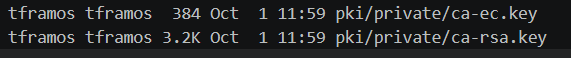

### 4.4 
#### Question 4

The new Openssl-cc.cnf file:
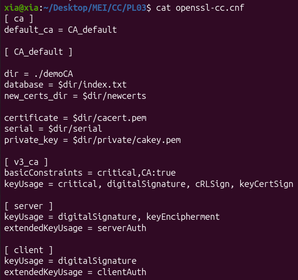

The CA directory structure was successfully created according to the OpenSSL configuration. The resulting structure contains the CA certificate, the certificate database, the serial number file, the directory for newly issued certificates, and the protected private key directory.
The permissions were verified with:


The private directory has permission 700, which means that only the owner can read, write, and access the directory. The CA private key cakey.pem has permission 600, meaning that only the owner can read and modify the key. These restrictive permissions are important because compromise of the CA private key would allow an attacker to sign certificates as the CA.
The index.txt file is currently empty because no certificates have yet been issued by the CA. The newcerts directory is also empty for the same reason. The serial file stores the serial number that will be assigned to the next certificate issued by the CA.


### 4.5
#### Question 5

The server certificate was successfully created using Elliptic Curve Cryptography with the secp521r1 curve, also known as NIST P-521.
The certificate was verified using:

```bash
openssl x509 -in server-ec.crt -text -noout
```

The output confirms that the certificate uses an elliptic-curve public key:
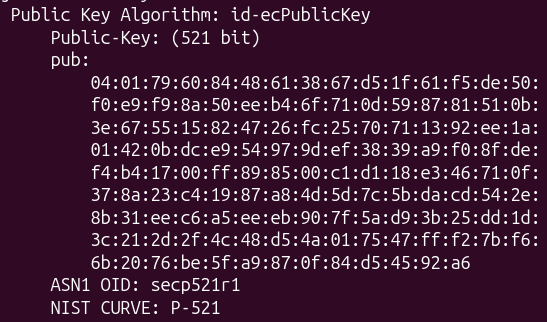

The certificate was signed using:
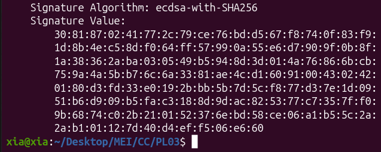

The issuer corresponds to the previously created Certificate Authority, while the subject identifies the server:
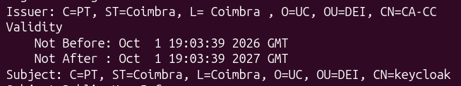

The server-specific X.509 extensions are also present:
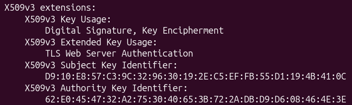

### 4.6
#### Question 6

The OCSP responder was started with:

```bash
openssl ocsp \
  -index pki/index.txt \
  -rsigner pki/ca.crt \
  -rkey pki/private/ca-ec.key \
  -CA pki/ca.crt \
  -port 8888
```

The options mean:

- `-index`: reads the CA certificate database.
- `-rsigner`: certificate used to sign OCSP responses.
- `-rkey`: private key matching the responder certificate.
- `-CA`: CA certificate.
- `-port 8888`: starts the responder on port 8888.

The server certificate was tested with:

```bash
openssl ocsp \
  -issuer pki/ca.crt \
  -cert pki/server.crt \
  -url http://127.0.0.1:8888 \
  -CAfile pki/ca.crt \
  -resp_text
```

The result was:

```text
Cert Status: good
```

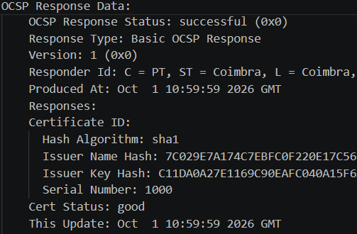

### 4.7
#### Question 7

The certificate was revoked with:

```bash
openssl ca -config openssl-cc.cnf \
  -revoke pki/revoked.crt \
  -crl_reason keyCompromise
```

The revoked status was checked with:

```bash
openssl ocsp \
  -issuer pki/ca.crt \
  -cert pki/revoked.crt \
  -url http://127.0.0.1:8888 \
  -CAfile pki/ca.crt \
  -resp_text
```

The result was:

```text
Cert Status: revoked
```

The CA database also marks the certificate with `R` (revoked):

```bash
grep '^R' pki/index.txt
```

The output marks serial `1001` (`revoked-client`) with `R`.

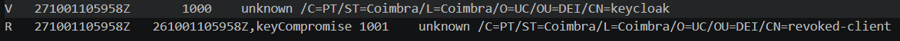

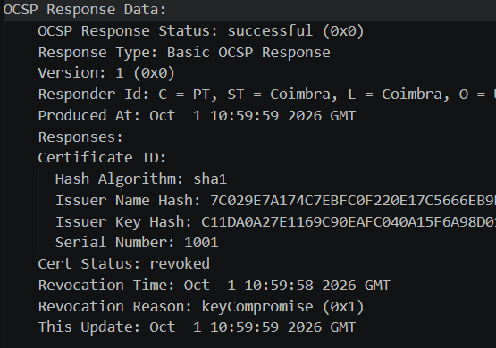

### 4.8
#### Question 8

The CRL was created with:

```bash
openssl ca -batch -config openssl-cc.cnf \
  -gencrl -out pki/crl/ca.crl
```

It was checked with:

```bash
openssl crl -in pki/crl/ca.crl -text -noout
```

The output shows the revoked certificate, serial number `1001`, and the
revocation reason `Key Compromise`.

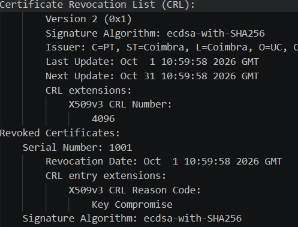